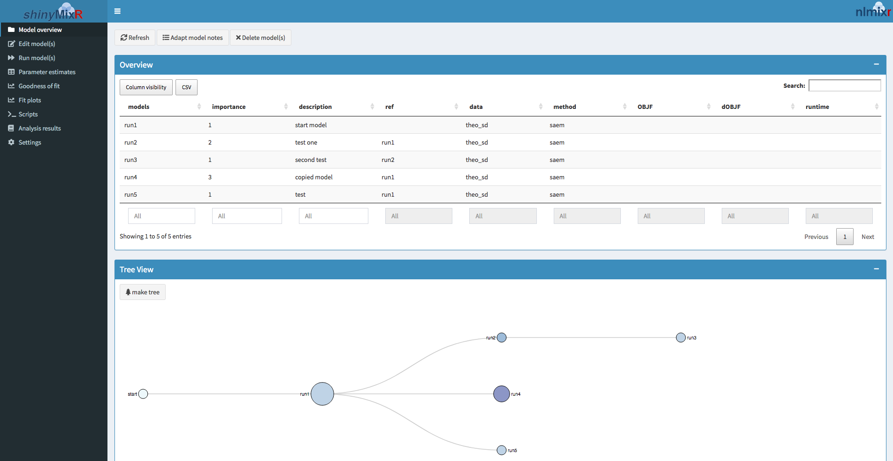
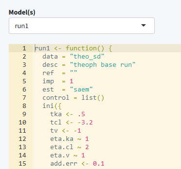
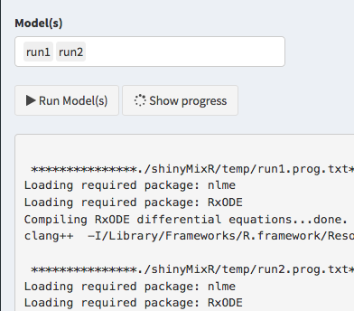
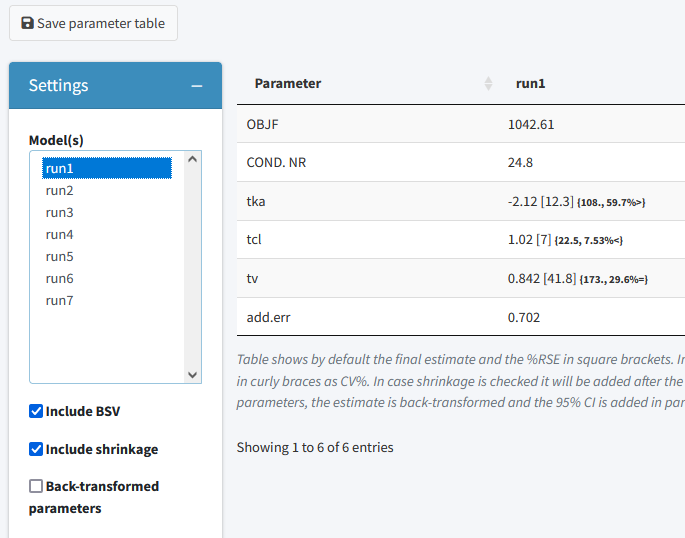
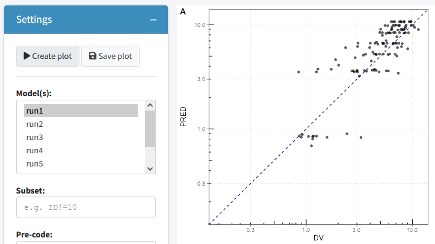
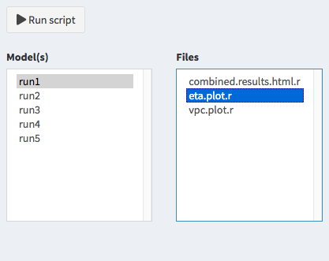

```{r echo=FALSE, results='hide'}
knitr::opts_chunk$set(fig.width=7, fig.height=4) 
```

# Introduction

The shinyMixR package is developed as a graphical user interface around the `nlmixr` package. 
It is build with the `shiny` package combined with `shinydashboard`. Many of the functions within the package can also be used outside the interface within an interactive R session. 
This vignette will give a brief introduction on how the package can be used and what the most important functions are. 
When working with this package, there are two important assumptions:

1. A specific folder structure should be in place. This structure is used by the package to read and write certain files (the folder structure can be generated automatically using the `create_proj` function)
2. Within a folder structure, multiple models can be present and is considered a "project". The package creates and manages a project object which is available in the global environment

# Getting started

To get started, first install the package using:

```R
devtools::install_github("richardhooijmaijers/shinyMixR")
```

Be aware that the `nlmixr`, `nlmixr.xpose` and `R3port` package should be installed before installing `shinyMixR`, e.g.:
```R
devtools::install_github("richardhooijmaijers/R3port")
devtools::install_github("nlmixrdevelopment/nlmixr")
devtools::install_github("nlmixrdevelopment/xpose.nlmixr")
```

The easiest way to get to know the package is to create the folder structure (which include some example models):

```{r results='hide'}
library(shinyMixR,quietly = TRUE)
create_proj()
```

By default, a folder structure is created within the current directory. The following folders are created:

- analysis: in this folder all plots and tables are saved in a structured way to make them accesible to the interface
- data: data files used by the models in R data format (.rds) 
- models: models, available as separate R scripts according the unified user interface in `nlmixr`
- scripts: generic analysis scipts made available in the interface
- shinyMixR: folder used by the interface to store temporarly files and results files

Once there is a folder structure present the interface can be started:

```{r eval=FALSE}
run_shinymixr(launch.browser = TRUE)
```

The interface will be started and a project object will be created in the global environment in which all information is kept/managed. If correct, the interface will open in the default browser and the following will be seen:



On the left side, there is sidebar with various menu items. The content of the main body will open with the model overview but  will change based on the selected menu item in the sidebar. The sidebar can be collapsed by clicking the three lines in the top bar, providing more room for the main body. 

## Overview 

The overview page can be used to see which models are present in a project, the relationship between models and to adapt model meta data. The overview can be exported to a CSV file and a selection of columns can be made that should be displayed (all using the `DT` package).

## Edit models



The edit tab can be used to edit existing models within an editor including syntax coloring (using `shinyAce`). It is also possible to create new models using various templates or to duplicate existing models.

## Run models



The run tab can be used to run models within a project. It is possible to run one or multiple models at once. Also it is possible to assess the intermediate output or progress for an nlmixr run.

## Parameter estimates



The parameter estimates tab can be used to generate a table with parameter estimates. In case multiple models are selected the table will show the results of each run in a separate column. This page is reactive which means that in case a different model is selected, the table is directly updated. There is also the possiblity to save the table to a latex/pdf or html file

## Goodness of fit



The goodness of fit tab can be used to generate a combination of 4 goodness of fit plots combined. By default nlmixr.xpose is used but direct ggplot can also be used by specifying this in the settings. Also here the plots can be saved to a latex/pdf or html file

## Fit plots


The fit plots tab can be used to generate a individual fit plots. The same options are present here as for the goodness of fit plots.

## Scripts



It is possible to write your own scripts that can be used to analyse model results. This script can be used to process the result for one or multiple models at once (the interface will include the name of the selected models in the script).
An example of how such a script will look like is included in the package

## Results


It is possible to view and combine the results from the models within a project within the last tab


# Interactive session

When working in an interactive R session, many functions used by the interface are also available from an interactive R session. When working outside the interface it is important to know how to interact with the project object.
This object should be created as one of the first steps because other function rely on the availability of this object:

```{r results='hide'}
proj_obj <- get_proj()
```

This function will look in the folder structure to create or update the available information. The result is a list that is build-up as follows:

```
object
|--- run 1
|    |--- model location
|    |--- model meta data
|    |--- model high level results
|
|--- ...
|
|--- meta data (time of last refresh)
```

In case this object is not present it will be created by looking at the files present in the current folder structure. In case the object is already present it will check if newer files are present in the current folder and will update the object with this information. Therefore one have to be aware that this function should be submitted manually in case new information is present in the one of the folders.

Once a folder structure is in place and the project object is created, an overview can be created for the available models and, if models are submitted, high level results. It is also possible to display a collapsible d3 tree view of the models. This is mainly useful in case reference to models is provided to show the hierachy of the models within a project:
```{r}
overview()
tree_overview()
```

Although the `nlmixr` package obiously has the possibilty to run nlmixr models, the shinyMixR package also have a function available named `run_nmx`. the main reason this function was written is the option to run the model in an external R session. This is necessary within the interface to overcome the application from freezing when a model is submitted. Also within an interactive R session it is convenient because you do not have to wait for a run to finish. An example how this can be used is given below:
```{r eval=TRUE, echo=FALSE}
proj_obj <- get_proj()
#run_nmx("run1",proj=proj_obj)
```
```{r eval=FALSE}
proj_obj <- get_proj()
run_nmx("run1",proj=proj_obj)
# progress of a run is written to external text file
# this can be read-in for intermediate assessment
readLines("shinyMixR/temp/run1.prog.txt")
```

The current version of the package has three functions for assessing the model results. The first function is to create a simple parameter table `par_table`. By default this function returns a data.frame. In case multiple models are selected, each column will have the results of the selected model. The results can also be written to a PDF (using latex) or html file using the `R3port` package:

```{r}
par_table(proj_obj,c("run1","run2"))
# par_table(proj_obj, models="run1", outnm="par.tex")
```

For assessing the goodness of fit, the `gof_plot` function can be used. This function will by default use the `nlmixr.xpose` package to create 4 different types of plots. It is also possible to directly create ggplot2 types of plots. By default the plots will be created within the R session but can also be written to pdf/html using the `R3port` package:

```{r}
res  <- readRDS("./shinyMixR/run1.res.rds")
gof_plot(res)
# gof_plot(res, mdlnm="run1", outnm="gof.tex")
```

The last plot is an individual fit plot `fit_plot`. This function will also by default use the `nlmixr.xpose` package to create a plot per individual including the observed data, indivual and population predictions. Also here it is possible to create ggplot2 types of plots and plots can be outputted to pdf/html:

```{r}
fit_plot(res, type="user")
# fit_plot(res, mdlnm="run1", outnm="fit.html")
```

